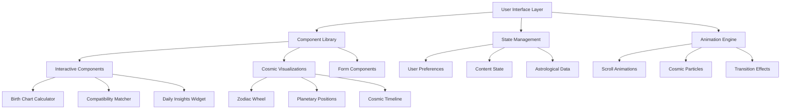

# Design Document

## Overview

The AstroAura UX Enhancement design transforms the existing beautiful cosmic-themed website into a dynamic, personalized, and interactive platform that serves as both the official AstroAura website AND a strategic conversion funnel for the mobile app. The design provides immediate value to users while maintaining the stunning visual aesthetic, leveraging modern web technologies optimized for GitHub Pages hosting. The enhanced website creates an immersive cosmic experience that seamlessly guides users from web discovery to mobile app download and engagement.

## Architecture

### Frontend Architecture



### Data Flow Architecture


### Progressive Enhancement Strategy

1. **Base Layer**: Semantic HTML with core functionality
2. **Enhancement Layer**: CSS animations and interactive elements
3. **Advanced Layer**: JavaScript-powered personalization and real-time features
4. **Premium Layer**: Account-based features and advanced calculations

## Components and Interfaces

### 1. Enhanced Homepage Components

#### Interactive Cosmic Header
- **Personalized Greeting System**: Dynamic welcome messages based on current astrological conditions
- **Real-time Zodiac Wheel**: Interactive wheel showing current planetary positions
- **Cosmic Weather Display**: Live astrological conditions with visual indicators
- **Quick Insight Cards**: Personalized daily insights that update based on user's astrological profile

```typescript
interface CosmicHeaderProps {
  userLocation?: GeolocationCoordinates;
  userBirthData?: BirthChartData;
  currentDateTime: Date;
  personalizedGreeting: string;
  cosmicWeather: CosmicWeatherData;
}
```

#### Dynamic Feature Showcase
- **Interactive App Previews**: Hover-activated mockups showing app functionality
- **Feature Comparison Matrix**: Interactive table comparing free vs premium features
- **User Journey Visualization**: Animated path showing user progression through the app
- **Social Proof Carousel**: Rotating testimonials with cosmic-themed animations

### 2. Enhanced Blog Experience

#### Intelligent Content System (Free Implementation)
- **Personalized Feed Algorithm**: Client-side content filtering using local storage and simple scoring algorithms
- **Smart Search Interface**: Local search with fuzzy matching and predefined astrological term dictionary
- **Topic Clustering**: Static topic grouping with dynamic filtering using JavaScript
- **Reading Progress Tracking**: Local storage-based progress tracking with visual indicators

```typescript
interface BlogEnhancementProps {
  userPreferences: UserPreferences;
  readingHistory: ArticleInteraction[];
  searchQuery: string;
  topicFilters: string[];
  personalizedFeed: Article[];
}
```

#### Interactive Article Features
- **Inline Astrological Calculators**: Birth chart snippets and compatibility checks within articles
- **Related Content Suggestions**: AI-powered recommendations based on article content
- **Social Sharing Cards**: Custom cosmic-themed sharing images with personalized elements
- **Comment and Discussion System**: Community engagement with astrological context

### 3. Interactive Astrological Tools

#### Birth Chart Calculator (Free Implementation)
- **Progressive Data Collection**: Step-by-step form with client-side validation
- **Visual Chart Rendering**: SVG-based interactive birth chart using free astronomical libraries (Swiss Ephemeris)
- **Interpretation Engine**: Rule-based interpretations using free astrological knowledge bases
- **Export and Sharing**: Client-side PDF generation and custom sharing cards

```typescript
interface BirthChartCalculator {
  birthData: {
    date: Date;
    time: string;
    location: GeolocationData;
  };
  chartConfiguration: ChartSettings;
  interpretations: ChartInterpretation[];
  visualElements: SVGChartElements;
}
```

#### Compatibility Matcher
- **Dual Input System**: Side-by-side birth data collection
- **Compatibility Scoring**: Multi-dimensional compatibility analysis
- **Relationship Insights**: Detailed explanations of astrological connections
- **Improvement Suggestions**: Actionable advice for relationship harmony

#### Daily Cosmic Dashboard
- **Personalized Horoscope**: Daily insights based on user's complete birth chart
- **Planetary Transit Tracker**: Visual timeline of current and upcoming transits
- **Moon Phase Calendar**: Interactive lunar calendar with personal relevance
- **Cosmic Event Notifications**: Alerts for significant astrological events

### 4. Personalization Engine

#### User Profile System
- **Astrological Profile Builder**: Comprehensive birth chart data collection
- **Preference Learning**: Machine learning-based preference detection
- **Content Customization**: Personalized content delivery and recommendations
- **Progress Tracking**: User journey and engagement analytics

```typescript
interface UserProfile {
  birthChart: BirthChartData;
  preferences: {
    topics: string[];
    contentTypes: string[];
    notificationSettings: NotificationPreferences;
  };
  engagementHistory: UserEngagement[];
  personalizedContent: ContentRecommendation[];
}
```

#### Recommendation System (Free Implementation)
- **Content-Based Filtering**: Local JavaScript-based recommendations using article tags and user reading history
- **Simple Collaborative Filtering**: Basic similarity matching using local storage data
- **Astrological Relevance**: Rule-based recommendations using free astrological libraries
- **Temporal Relevance**: Time-sensitive content based on browser date/time and free astronomical data

### 5. Community Features

#### Cosmic Journal System (Free Implementation)
- **Private Journaling**: Local storage-based journaling with optional export functionality
- **Mood Tracking**: Simple correlation tracking using free astronomical data
- **Experience Sharing**: Static sharing options with privacy-first approach
- **Insight Generation**: Rule-based pattern recognition using local data analysis

#### Community Matching
- **Astrological Compatibility**: Friend suggestions based on birth chart compatibility
- **Interest-Based Groups**: Communities organized around astrological topics
- **Experience Sharing**: Anonymous sharing of cosmic experiences and insights
- **Mentorship System**: Connection between experienced and novice astrology enthusiasts

## Data Models

### User Data Model
```typescript
interface User {
  id: string;
  profile: {
    birthChart: BirthChartData;
    preferences: UserPreferences;
    privacySettings: PrivacySettings;
  };
  engagement: {
    readingHistory: ArticleInteraction[];
    toolUsage: ToolUsageData[];
    communityActivity: CommunityEngagement[];
  };
  personalization: {
    contentRecommendations: ContentRecommendation[];
    customizedExperience: PersonalizationSettings;
  };
}
```

### Content Data Model
```typescript
interface Article {
  id: string;
  metadata: {
    title: string;
    description: string;
    publishDate: Date;
    author: Author;
    tags: string[];
    astrologicalRelevance: AstrologicalContext;
  };
  content: {
    sections: ContentSection[];
    interactiveElements: InteractiveElement[];
    relatedTools: ToolReference[];
  };
  engagement: {
    views: number;
    shares: number;
    timeSpent: number;
    userRatings: Rating[];
  };
}
```

### Astrological Data Model
```typescript
interface BirthChartData {
  birthInfo: {
    date: Date;
    time: string;
    location: GeolocationData;
  };
  planetaryPositions: PlanetPosition[];
  houses: HousePosition[];
  aspects: AspectData[];
  interpretations: {
    personality: PersonalityInsight[];
    relationships: RelationshipInsight[];
    career: CareerInsight[];
    spirituality: SpiritualInsight[];
  };
}
```

## Error Handling

### Progressive Degradation Strategy
1. **Core Functionality**: Ensure basic website functionality without JavaScript
2. **Enhanced Features**: Graceful degradation when advanced features fail
3. **Offline Support**: Service worker implementation for basic content access
4. **Error Recovery**: User-friendly error messages with alternative actions

### Error Scenarios and Responses
- **API Failures**: Cached content delivery with offline indicators
- **Calculation Errors**: Clear error messages with troubleshooting steps
- **Network Issues**: Progressive loading with skeleton screens
- **Browser Compatibility**: Feature detection with polyfill fallbacks

## Testing Strategy

### User Experience Testing
1. **Usability Testing**: Task-based testing with target user groups
2. **A/B Testing**: Conversion optimization for key user journeys
3. **Accessibility Testing**: WCAG 2.1 AA compliance verification
4. **Performance Testing**: Core Web Vitals optimization and monitoring

### Technical Testing (Free Tools)
1. **Unit Testing**: Component-level testing with free testing frameworks (Jest, Vitest)
2. **Integration Testing**: Local testing with mock data and free testing utilities
3. **End-to-End Testing**: Free browser automation with Playwright or Puppeteer
4. **Cross-Browser Testing**: Manual testing with free browser developer tools

### Astrological Accuracy Testing
1. **Calculation Verification**: Astronomical calculation accuracy testing
2. **Data Validation**: Birth chart data integrity and validation
3. **Interpretation Quality**: AI-generated content quality assurance
4. **Cultural Sensitivity**: Astrological interpretation cultural appropriateness

## Performance Optimization

### Loading Strategy
- **Critical Path Optimization**: Above-the-fold content prioritization
- **Progressive Loading**: Lazy loading for non-critical components
- **Image Optimization**: WebP format with fallbacks and responsive images
- **Code Splitting**: Dynamic imports for feature-specific functionality

### Caching Strategy
- **Static Asset Caching**: Long-term caching for images and fonts
- **API Response Caching**: Intelligent caching for astrological calculations
- **User Data Caching**: Local storage for personalization data
- **Service Worker**: Offline-first approach for core functionality

### Animation Performance
- **GPU Acceleration**: CSS transforms and opacity for smooth animations
- **Animation Optimization**: RequestAnimationFrame for custom animations
- **Reduced Motion**: Respect user preferences for motion sensitivity
- **Performance Monitoring**: Real-time performance metrics and optimization

## Security and Privacy

### Data Protection
- **Privacy by Design**: Minimal data collection with explicit consent
- **Data Encryption**: End-to-end encryption for sensitive user data
- **Anonymization**: User data anonymization for analytics and recommendations
- **GDPR Compliance**: Full compliance with data protection regulations

### User Control
- **Privacy Dashboard**: Comprehensive privacy settings and data management
- **Data Export**: User data portability and export functionality
- **Account Deletion**: Complete data removal with verification process
- **Consent Management**: Granular consent controls for different data uses

This design provides a comprehensive foundation for transforming the AstroAura website into a dynamic, personalized, and engaging platform that serves as both a standalone value provider and an effective funnel for mobile app conversion.
## F
ree and Open Source Implementation Strategy

### Core Technologies (All Free)
- **Frontend Framework**: Vanilla JavaScript or free frameworks (Vue.js, React)
- **Astrological Calculations**: Swiss Ephemeris (free astronomical library)
- **Charts and Visualizations**: D3.js or Chart.js (free libraries)
- **UI Components**: Custom CSS with free icon libraries (Font Awesome, Feather Icons)
- **Build Tools**: Vite, Webpack, or Parcel (all free)

### Free Data Sources
- **Astronomical Data**: NASA JPL ephemeris data (public domain)
- **Location Services**: Browser geolocation API (free)
- **Time Zone Data**: IANA Time Zone Database (free)
- **Astrological Interpretations**: Open-source astrological knowledge bases

### Storage Solutions (GitHub Pages Optimized)
- **User Data**: Browser localStorage and IndexedDB (completely free)
- **Static Hosting**: GitHub Pages (current hosting solution)
- **Content Management**: Jekyll (GitHub Pages native support)
- **Analytics**: Google Analytics (free tier) for conversion tracking
- **Asset Delivery**: GitHub CDN for fast global delivery

### No Paid Dependencies
- No third-party APIs requiring payment
- No premium libraries or frameworks
- No paid hosting services required
- No subscription-based tools
- All features implementable with free, open-source solutions

This ensures the entire enhancement can be implemented without any ongoing costs or paid service dependencies.
## Mobil
e App Conversion Strategy

### Strategic Funnel Design
The website serves as the primary conversion funnel for the AstroAura mobile app, with carefully designed touchpoints throughout the user journey:

#### Homepage Conversion Elements
- **Hero Section**: Prominent Google Play Store download button with social proof (4.9⭐ rating, 15k+ users)
- **Feature Previews**: Interactive demos that showcase Android app functionality
- **Value Proposition**: Clear benefits of downloading the full Android app
- **Trust Indicators**: User testimonials and Google Play Store ratings

#### Progressive Engagement Strategy
1. **Discovery Phase**: Users explore website features and get immediate value
2. **Interest Phase**: Interactive tools demonstrate app capabilities
3. **Consideration Phase**: Comparison of web vs mobile app features
4. **Conversion Phase**: Strategic app download prompts at high-engagement moments
5. **Retention Phase**: Email capture for continued engagement

#### Conversion Optimization Features
- **Smart Download Prompts**: Context-aware app download suggestions
- **Feature Gating**: Some advanced features available only in mobile app
- **Seamless Data Transfer**: QR codes or email links to transfer web data to app
- **Exit-Intent Popups**: Last-chance app download offers
- **Social Proof Integration**: Real-time download counters and user testimonials

### Website as Official Brand Hub

#### Comprehensive Information Architecture
- **About Page**: Complete AstroAura story, mission, and team information
- **Features Page**: Detailed feature comparison between web and mobile experiences
- **Privacy Policy**: Comprehensive privacy policy covering both web and mobile app
- **Contact Page**: Official support channels and business inquiries
- **Press Kit**: Media resources and brand guidelines
- **Terms of Service**: Legal terms covering all AstroAura services

#### Brand Consistency
- **Visual Identity**: Consistent cosmic theme across all pages
- **Messaging**: Unified brand voice and value propositions
- **User Experience**: Seamless transition from web to mobile app
- **Content Strategy**: Blog content that supports both web engagement and app conversion

## GitHub Pages Optimization

### Static Site Architecture
```
astroaura-website/
├── _config.yml (Jekyll configuration)
├── _layouts/ (Page templates)
├── _includes/ (Reusable components)
├── _sass/ (Modular CSS)
├── assets/ (Images, JS, CSS)
├── blog/ (Blog posts and structure)
├── _data/ (Site data and configurations)
├── pages/ (Static pages)
└── scripts/ (Build and deployment scripts)
```

### Jekyll Integration Benefits
- **Automatic Building**: GitHub Pages builds Jekyll sites automatically
- **Template System**: Reusable layouts and includes for consistency
- **Blog Integration**: Native blog functionality with markdown support
- **Data Files**: YAML/JSON data files for dynamic content
- **Plugin Support**: Limited but useful plugins for GitHub Pages

### Performance Optimization for GitHub Pages
- **Asset Optimization**: Compressed images and minified CSS/JS
- **Caching Strategy**: Proper cache headers for static assets
- **CDN Utilization**: GitHub's global CDN for fast delivery
- **Progressive Loading**: Lazy loading for images and non-critical content
- **Service Worker**: Offline functionality and caching

### Deployment and Maintenance
- **Automated Deployment**: Push to main branch triggers automatic deployment
- **Version Control**: Full version history and rollback capabilities
- **Collaborative Development**: Multiple contributors with proper workflows
- **Content Management**: Easy content updates through GitHub interface or CMS

## Legal and Compliance Pages

### Privacy Policy Enhancement
- **Solo Developer Transparency**: Clear explanation that this is a solo-developed Android app with personal data handling
- **Data Collection Transparency**: Honest explanation of what data is collected and why, from a solo developer perspective
- **User Rights**: GDPR compliance with user data rights and direct contact with you
- **Cookie Policy**: Simple, clear cookie usage explanation for website
- **Android App Privacy**: Specific privacy practices for the Android application
- **Third-Party Services**: Transparent disclosure of any third-party integrations used
- **Personal Contact**: Direct contact with you for privacy concerns and questions

### Contact Page Enhancement
- **Personal Contact**: Direct email contact with you as the developer
- **Social Media**: Your personal/professional social media channels
- **Support Process**: Clear explanation of how you handle user support as a solo developer
- **Response Time Expectations**: Honest communication about response times for a solo operation
- **FAQ Integration**: Common questions and answers to reduce your support workload
- **Feedback Welcome**: Emphasis on welcoming user feedback and suggestions

### Terms of Service
- **Service Coverage**: Terms covering both website and Android app usage
- **User Responsibilities**: Clear guidelines for appropriate use
- **Intellectual Property**: Protection of AstroAura brand and content
- **Limitation of Liability**: Appropriate legal protections
- **Dispute Resolution**: Clear process for handling disputes
- **Android-Specific Terms**: Google Play Store compliance and Android-specific considerations

### About Page Enhancement
- **Personal Story**: Authentic narrative about the solo developer's journey and passion for astrology
- **Developer Background**: Your expertise, motivation, and vision for AstroAura
- **Technology Approach**: Personal explanation of how you built the AI-powered astrological insights
- **Multilingual Support**: Story behind supporting 11 languages and global accessibility
- **Community Impact**: How you're personally serving the global astrology community
- **Development Journey**: Behind-the-scenes look at building AstroAura as a solo project

This comprehensive approach ensures the website serves effectively as both the official AstroAura brand hub and a high-converting funnel for mobile app downloads, while maintaining full compliance and transparency.## So
lo Developer Advantages

### Authentic Personal Connection
- **Direct Communication**: Users can communicate directly with the creator
- **Personal Story**: Authentic narrative about your passion for astrology and technology
- **Rapid Response**: Ability to quickly implement user feedback and suggestions
- **Personal Touch**: Handcrafted experience with attention to individual user needs
- **Transparency**: Complete transparency about development process and decisions

### Trust Building Elements
- **Developer Profile**: Personal introduction and background on About page
- **Development Blog**: Behind-the-scenes content about building AstroAura
- **User Testimonials**: Personal responses and interactions with users
- **Open Communication**: Direct email and social media accessibility
- **Honest Limitations**: Transparent about being a solo operation

### Content Strategy for Solo Developer
- **Personal Voice**: First-person content that reflects your personality and expertise
- **Development Journey**: Blog posts about challenges and successes in building the app
- **User Stories**: Personal interactions and feedback from your user community
- **Technical Insights**: Sharing knowledge about astrology algorithms and app development
- **Community Building**: Creating a personal connection with your user base

### Operational Considerations
- **Sustainable Workload**: Design features that don't require constant manual maintenance
- **Automated Systems**: Implement automation where possible to reduce manual work
- **Clear Boundaries**: Set realistic expectations for response times and support
- **Scalable Architecture**: Build systems that can grow without requiring proportional time investment
- **Community Self-Service**: Provide comprehensive FAQs and self-help resources

This personal approach can actually be a significant competitive advantage, as users often prefer supporting individual creators over large corporations, especially in the spiritual and astrology space where authenticity and personal connection are highly valued.## Andr
oid-Only Strategy

### Focused Platform Benefits
- **Streamlined Development**: Focus all resources on perfecting the Android experience
- **Google Play Store Optimization**: Dedicated ASO (App Store Optimization) for Google Play
- **Android-Specific Features**: Leverage Android-specific capabilities and design patterns
- **Unified User Experience**: Consistent experience across website and Android app
- **Simplified Support**: Single platform reduces complexity and support overhead

### Website Conversion Elements
- **Single Call-to-Action**: Clear, prominent "Download on Google Play" buttons
- **Android Screenshots**: Showcase app screenshots specifically from Android devices
- **Google Play Ratings**: Highlight Google Play Store ratings and reviews
- **Android Compatibility**: Emphasize broad Android device compatibility
- **QR Code Downloads**: Easy QR code scanning for direct Google Play Store access

### Content Strategy Adjustments
- **Android User Focus**: Content and features tailored for Android users
- **Google Play Store Integration**: Deep linking to specific app store pages
- **Android Community**: Build community around Android users specifically
- **Device Compatibility**: Clear information about supported Android versions
- **Google Services Integration**: Leverage Google services where beneficial

### Marketing Advantages
- **Targeted Messaging**: Focus messaging on Android users and Google ecosystem
- **Cost Efficiency**: Marketing budget focused on single platform
- **Community Building**: Build strong Android user community
- **Feature Parity**: Ensure website features complement Android app perfectly
- **Google Play Console**: Utilize Google Play Console analytics for insights

### Technical Considerations
- **Progressive Web App**: Consider PWA features for iOS users who can't download the app
- **Web App Capabilities**: Enhanced web experience for non-Android users
- **Cross-Platform Web**: Ensure website works perfectly on all devices, even if app is Android-only
- **Future Expansion**: Architecture that allows for iOS expansion later if desired

This Android-focused approach allows for deeper integration with Google services, more focused development resources, and a streamlined user experience that can be perfectly optimized for the Google Play Store ecosystem.