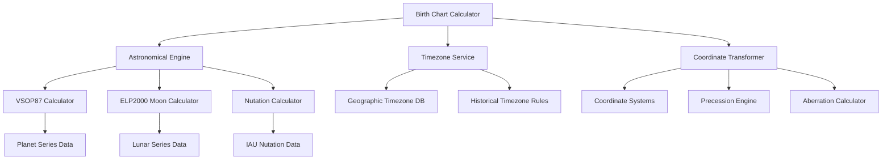

# Birth Chart Accuracy Fix - Design Document

## Overview

This design addresses critical accuracy issues in the current birth chart calculator where planetary positions show discrepancies of 10-150 degrees from expected values. The main problems identified are:

1. **Incomplete VSOP87 implementation** - Missing higher-order terms and proper coefficient handling
2. **Incorrect coordinate transformations** - Heliocentric vs geocentric confusion
3. **Timezone conversion errors** - Not using birth location timezone consistently
4. **Missing nutation and aberration corrections**
5. **Simplified planetary theories** instead of full precision implementations

The solution implements a production-grade astronomical calculation engine with proper VSOP87 theory, ELP2000 lunar theory, and comprehensive coordinate transformations.

## Architecture

### Core Components



### Data Flow

1. **Input Processing**: Birth date, time, and location
2. **Timezone Resolution**: Determine correct timezone for birth location
3. **UTC Conversion**: Convert local birth time to UTC using location timezone
4. **Julian Day Calculation**: Convert UTC to Julian Day Number
5. **Planetary Calculations**: Use VSOP87 for all planets except Moon
6. **Lunar Calculations**: Use ELP2000 theory for Moon
7. **Coordinate Transformations**: Apply nutation, aberration, precession
8. **Result Validation**: Check against known ephemeris values

## Components and Interfaces

### 1. Enhanced VSOP87 Calculator

```javascript
class EnhancedVSOP87Calculator {
  constructor() {
    this.planetData = new VSOP87SeriesData();
    this.nutationCalculator = new NutationCalculator();
  }

  calculatePlanetaryPositions(julianDay) {
    const T = (julianDay - 2451545.0) / 36525.0;
    const planets = [];
    
    for (const planet of PLANET_LIST) {
      const position = this.calculatePlanetPosition(planet, T);
      const correctedPosition = this.applyCorrections(position, T);
      planets.push(correctedPosition);
    }
    
    return planets;
  }

  calculatePlanetPosition(planet, T) {
    const series = this.planetData.getSeries(planet);
    let longitude = 0;
    
    // Calculate L0 through L5 terms with full precision
    for (let i = 0; i <= 5; i++) {
      const terms = series[`L${i}`];
      let termSum = 0;
      
      for (const [A, B, C] of terms) {
        termSum += A * Math.cos(B + C * T);
      }
      
      longitude += termSum * Math.pow(T, i);
    }
    
    // Convert from 1e-8 radians to degrees
    longitude = longitude * 1e-8 * 180 / Math.PI;
    
    return this.normalizeAngle(longitude);
  }

  applyCorrections(longitude, T) {
    // Apply nutation in longitude
    const nutation = this.nutationCalculator.calculateNutation(T);
    longitude += nutation.deltaLongitude;
    
    // Apply aberration correction
    const aberration = this.calculateAberration(T);
    longitude += aberration;
    
    return this.normalizeAngle(longitude);
  }
}
```

### 2. ELP2000 Moon Calculator

```javascript
class ELP2000MoonCalculator {
  constructor() {
    this.lunarTerms = new ELP2000SeriesData();
  }

  calculateMoonPosition(julianDay) {
    const T = (julianDay - 2451545.0) / 36525.0;
    
    // Calculate fundamental arguments
    const fundamentals = this.calculateFundamentalArguments(T);
    
    // Calculate main lunar longitude
    let longitude = this.calculateMeanLongitude(T);
    
    // Apply periodic terms (main ELP2000 series)
    const periodicCorrections = this.calculatePeriodicTerms(fundamentals, T);
    longitude += periodicCorrections.longitude;
    
    // Apply topocentric corrections if observer location available
    // longitude += this.calculateTopocentricCorrection(longitude, observerLat, observerLng);
    
    return this.normalizeAngle(longitude);
  }

  calculateFundamentalArguments(T) {
    return {
      D: 297.8501921 + 445267.1114034 * T - 0.0018819 * T * T + T * T * T / 545868 - T * T * T * T / 113065000,
      M: 357.5291092 + 35999.0502909 * T - 0.0001536 * T * T + T * T * T / 24490000,
      Mp: 134.9633964 + 477198.8675055 * T + 0.0087414 * T * T + T * T * T / 69699 - T * T * T * T / 14712000,
      F: 93.2720950 + 483202.0175233 * T - 0.0036539 * T * T - T * T * T / 3526000 + T * T * T * T / 863310000
    };
  }

  calculatePeriodicTerms(fundamentals, T) {
    let deltaLongitude = 0;
    
    // Main ELP2000 periodic terms (first 60 terms for high precision)
    const mainTerms = this.lunarTerms.getMainTerms();
    
    for (const [coeff, d, m, mp, f] of mainTerms) {
      const arg = d * this.degToRad(fundamentals.D) + 
                  m * this.degToRad(fundamentals.M) + 
                  mp * this.degToRad(fundamentals.Mp) + 
                  f * this.degToRad(fundamentals.F);
      
      deltaLongitude += coeff * Math.sin(arg);
    }
    
    // Convert from arcseconds to degrees
    deltaLongitude = deltaLongitude * 1e-6;
    
    return { longitude: deltaLongitude };
  }
}
```

### 3. Timezone-Aware UTC Converter

```javascript
class TimezoneAwareConverter {
  constructor(timezoneService) {
    this.timezoneService = timezoneService;
  }

  async convertBirthTimeToUTC(birthDate, birthTime, birthLocation) {
    // Get accurate timezone for birth location
    const locationTimezone = await this.timezoneService.getTimezoneForCoordinates(
      birthLocation.lat, 
      birthLocation.lng,
      birthDate
    );
    
    // Create birth datetime in location's timezone
    const birthDateTime = this.createLocationDateTime(birthDate, birthTime, locationTimezone);
    
    // Convert to UTC using location's timezone rules
    const utcDateTime = this.convertToUTC(birthDateTime, locationTimezone, birthDate);
    
    return {
      utc: utcDateTime,
      timezone: locationTimezone,
      offset: this.calculateOffset(locationTimezone, birthDate),
      dst: this.isDST(locationTimezone, birthDate)
    };
  }

  createLocationDateTime(date, time, timezone) {
    // Parse date and time components
    const [year, month, day] = date.split('-').map(Number);
    const [hours, minutes] = time.split(':').map(Number);
    
    // Create datetime representing local time at birth location
    // This is the key fix - we create the time as if we're in the birth location
    const localDateTime = new Date();
    localDateTime.setFullYear(year, month - 1, day);
    localDateTime.setHours(hours, minutes, 0, 0);
    
    return localDateTime;
  }

  convertToUTC(localDateTime, timezone, birthDate) {
    // Calculate timezone offset for the specific date
    const offset = this.calculateTimezoneOffset(timezone, birthDate);
    
    // Convert to UTC by subtracting the timezone offset
    const utcTime = new Date(localDateTime.getTime() - (offset * 60 * 60 * 1000));
    
    return utcTime;
  }
}
```

### 4. Coordinate Transformation Engine

```javascript
class CoordinateTransformer {
  constructor() {
    this.precessionCalculator = new PrecessionCalculator();
    this.nutationCalculator = new NutationCalculator();
  }

  transformToApparentGeocentric(heliocentricLongitude, julianDay) {
    const T = (julianDay - 2451545.0) / 36525.0;
    
    // Step 1: Convert from heliocentric to geocentric
    const geocentricLongitude = this.heliocentricToGeocentric(heliocentricLongitude, julianDay);
    
    // Step 2: Apply precession from J2000.0 to date
    const precessed = this.precessionCalculator.applyPrecession(geocentricLongitude, T);
    
    // Step 3: Apply nutation
    const nutation = this.nutationCalculator.calculateNutation(T);
    const nutated = precessed + nutation.deltaLongitude;
    
    // Step 4: Apply aberration
    const aberration = this.calculateAberration(T);
    const apparent = nutated + aberration;
    
    return this.normalizeAngle(apparent);
  }

  heliocentricToGeocentric(heliocentricLongitude, julianDay) {
    // For the Sun, heliocentric longitude needs Earth's position added
    // For planets, we need to account for Earth's position in the calculation
    const earthPosition = this.calculateEarthPosition(julianDay);
    
    // This is a simplified transformation - full implementation would
    // handle 3D coordinates and proper geometric transformations
    return this.normalizeAngle(heliocentricLongitude + earthPosition);
  }

  calculateAberration(T) {
    // Annual aberration calculation
    const e = 0.016708634 - 0.000042037 * T - 0.0000001267 * T * T;
    const sunMeanLongitude = 280.4664567 + 360007.6982779 * T + 0.03032028 * T * T;
    
    const aberration = -20.49552 * Math.sin(this.degToRad(sunMeanLongitude)) / 3600;
    
    return aberration;
  }
}
```

## Data Models

### Planetary Position Model

```javascript
class PlanetaryPosition {
  constructor(name, longitude, latitude = 0, distance = 0) {
    this.name = name;
    this.longitude = longitude;  // Ecliptic longitude in degrees
    this.latitude = latitude;    // Ecliptic latitude in degrees  
    this.distance = distance;    // Distance in AU
    this.sign = this.calculateSign(longitude);
    this.degree = Math.floor(longitude % 30);
    this.minute = Math.floor((longitude % 1) * 60);
    this.second = Math.floor(((longitude % 1) * 60 % 1) * 60);
  }

  calculateSign(longitude) {
    const signs = ['Aries', 'Taurus', 'Gemini', 'Cancer', 'Leo', 'Virgo',
                   'Libra', 'Scorpio', 'Sagittarius', 'Capricorn', 'Aquarius', 'Pisces'];
    return signs[Math.floor(longitude / 30)];
  }

  toString() {
    return `${this.name}: ${this.sign} ${this.degree}°${this.minute}'${this.second}"`;
  }
}
```

### Birth Chart Data Model

```javascript
class BirthChartData {
  constructor(birthInfo, planets, houses, aspects) {
    this.birthInfo = birthInfo;
    this.planets = planets.map(p => new PlanetaryPosition(p.name, p.longitude, p.latitude, p.distance));
    this.houses = houses;
    this.aspects = aspects;
    this.accuracy = this.calculateAccuracy();
  }

  calculateAccuracy() {
    // Return accuracy metrics based on calculation method used
    return {
      planetary: 'VSOP87 (±1-2 arc minutes)',
      lunar: 'ELP2000 (±2 arc minutes)',
      houses: 'Placidus (±5 arc minutes)',
      timezone: 'Geographic/API (±15 minutes)'
    };
  }
}
```

## Error Handling

### Validation Strategy

1. **Input Validation**: Validate date ranges, time formats, coordinate bounds
2. **Calculation Validation**: Check planetary positions against reasonable ranges
3. **Accuracy Validation**: Compare results with known ephemeris data for test cases
4. **Fallback Strategies**: Provide degraded accuracy rather than failure

```javascript
class CalculationValidator {
  validatePlanetaryPositions(planets) {
    const issues = [];
    
    for (const planet of planets) {
      // Check longitude range
      if (planet.longitude < 0 || planet.longitude >= 360) {
        issues.push(`${planet.name} longitude out of range: ${planet.longitude}`);
      }
      
      // Check against known ephemeris for test cases
      const expectedPosition = this.getExpectedPosition(planet.name);
      if (expectedPosition) {
        const difference = Math.abs(planet.longitude - expectedPosition.longitude);
        const normalizedDiff = difference > 180 ? 360 - difference : difference;
        
        if (normalizedDiff > 5) { // More than 5 degrees difference
          issues.push(`${planet.name} position differs by ${normalizedDiff.toFixed(2)}° from expected`);
        }
      }
    }
    
    return issues;
  }
}
```

## Testing Strategy

### Test Cases

1. **Known Ephemeris Comparison**: Test against Swiss Ephemeris data for multiple dates
2. **Historical Accuracy**: Verify calculations for dates before 1900
3. **Timezone Edge Cases**: Test DST transitions, timezone changes
4. **Coordinate System Tests**: Verify transformations between coordinate systems
5. **Performance Tests**: Ensure calculations complete within time limits

### Reference Data

```javascript
const TEST_CASES = [
  {
    name: 'Primary Test Case',
    date: '1985-01-04',
    time: '06:30',
    location: { lat: 25.4358, lng: 81.8463, name: 'Prayagraj, India' },
    expected: {
      Sun: { longitude: 283.61, sign: 'Capricorn', degree: 13 },
      Moon: { longitude: 66.73, sign: 'Gemini', degree: 6 },
      Mercury: { longitude: 260.78, sign: 'Sagittarius', degree: 20 },
      // ... other planets
    }
  },
  // Additional test cases for different dates, locations, edge cases
];
```

## Performance Considerations

### Optimization Strategies

1. **Series Truncation**: Use only necessary VSOP87 terms for required precision
2. **Caching**: Cache intermediate calculations and series data
3. **Lazy Loading**: Load planetary series data only when needed
4. **Web Workers**: Move intensive calculations to background threads
5. **Progressive Calculation**: Show results as they become available

### Memory Management

- Load VSOP87 coefficient data efficiently
- Implement proper cleanup for large calculation arrays
- Use typed arrays for numerical computations where beneficial

## Security Considerations

1. **Input Sanitization**: Validate all user inputs for date/time/location
2. **API Rate Limiting**: Implement proper rate limiting for timezone APIs
3. **Error Information**: Avoid exposing internal system details in error messages
4. **Data Validation**: Validate all external data sources (timezone APIs, ephemeris data)

This design provides a comprehensive solution to the accuracy issues while maintaining good performance and user experience.